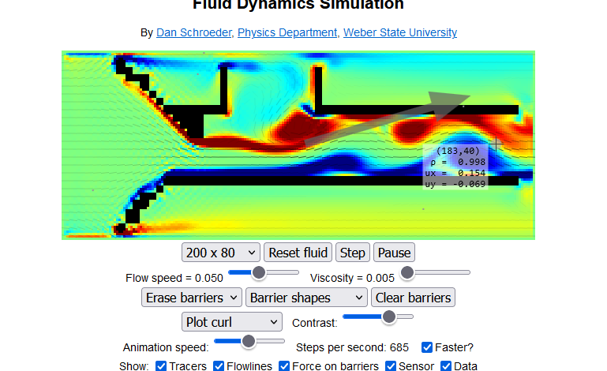

# Cheese Ball Gun Project

This project is a fun and innovative application of Arduino and the Useful Sensors Person Sensor. We've created a cheese ball gun that is triggered when a person's face is detected. The gun is hooked up to a hair dryer, creating an interesting turbulence effect when the gun is fired.

## Components

The main components of this project are:

- Arduino
- Useful Sensors Person Sensor
- Hair Dryer
- 3D printed parts for the cheese ball gun
- Cheese balls 🧀

## 3D Models

The 3D models for the cheese ball gun include:

- `base_cheese_ball_gun.stl`: The base of the gun. [Download here](#)
- `barrel_cheesball_gun.stl`: The barrel of the gun. [Download here](#)
- `main_attachment.stl`: The main attachment for the gun. [Download here](#)
- `IbbieBaba_Hopper.stl`: The hopper for the cheese balls, special thanks to IbbieBaba for this part. [Download here](#)

<video width="320" height="240">
  <source src="chamber.mp4" type="video/mp4">
</video>

## Arduino Setup

The Arduino is set up to control a relay based on face detection using the Useful Sensors Person Sensor. When a face is detected, the relay is triggered, firing the cheese ball gun. For more details on the Arduino setup, please refer to the [Useful Sensors Person Sensor Arduino repository](https://github.com/usefulsensors/person_sensor_arduino)[1].

You will need to load the code onto the Arduino using the Arduino IDE, which can be downloaded from [here](https://www.arduino.cc/en/software).

## Wiring Information

You'll need to consult your Arduino board's documentation to find out what the pins or connectors used for the I2C interface are. The Useful Sensors Person Sensor communicates with the Arduino over the I2C interface. The sensor's I2C address is `0x62`.

## References

This is made possible through a turbulence effect caused by the barrier demonstrated in the image below:

[1] [Useful Sensors Person Sensor Arduino repository](https://github.com/usefulsensors/person_sensor_arduino)

Please replace `video_link` and `image_link` with the actual URLs of your video and image. Also, replace the `#` in the download links with the actual URLs of your 3D model files.
